# Systems & Logic Hooks (Beta Release V4.5)

This document provides a comprehensive technical reference for the **Antigravity Protocol** and the **Core Application Hooks** that power the indiiOS ecosystem.

---

## 1. 🛡️ Antigravity Protocol (V4.5 Beta Final)

The Antigravity Protocol is the governing framework for autonomous agents. Version 4.5 introduces **Cortex Synchronization** and **Production Parity Verification**.

### 🏗️ System Architecture

The protocol ensures that every file modification is validated against the global type system and module-specific standards.

```mermaid
graph TD
    A["🤖 Agent: Antigravity"] -->|File Edit| B["🛂 Guardrail: after_file_edit"]
    B -->|Lint/Fix/Types| C["💾 Local Storage"]
    C -->|Completion Signal| D["🛑 Gatekeeper: on_stop"]
    D -->|Test Fail/Regress| A
    D -->|Dependency Break| A
    D -->|Cortex Mismatch| A
    D -->|Validation Pass| E["🚀 Production Build / Graphite Stack"]
    
    subgraph "Beta Verification Loop (Strict)"
    A
    B
    D
    end
```



### 🪝 Protocol Hooks (`hooks.json`)

- **`session_start`**: [`scripts/session_start.sh`](file:///Volumes/X%20SSD%202025/Users/narrowchannel/Desktop/indiiOS-Alpha-Electron/scripts/session_start.sh). Performs deep workspace analysis, `npm install` synchronization, and **Cortex type regeneration** (ensuring local types match the remote schema).
- **`after_file_edit`**: [`scripts/after_edit.sh`](file:///Volumes/X%20SSD%202025/Users/narrowchannel/Desktop/indiiOS-Alpha-Electron/scripts/after_edit.sh). Triggered post-edit. Handles ESLint auto-fixes, Prettier formatting, and localized type checks. **Failure in `after_edit` results in immediate retry.**
- **`on_stop`**: [`scripts/on_stop.sh`](file:///Volumes/X%20SSD%202025/Users/narrowchannel/Desktop/indiiOS-Alpha-Electron/scripts/on_stop.sh). The Beta Gatekeeper. Executes full regression suites ("The Gauntlet"), production build sanity checks, and ensures no cross-module dependency breaks.

---

## 2. ⚛️ Core Application Hooks

### 🌐 Global State

#### `useStore`

**Status:** `PRODUCTION_READY`
**Location:** `src/core/store/index.ts`

The primary entry point for global state management via Zustand. It utilizes a **Slice Pattern** for modularity.

| Slice | Responsibility | Key Actions |
| :--- | :--- | :--- |
| **Profile** | User/Org data | `setUserProfile`, `setActiveOrg` |
| **App** | UI Layout/Navigation | `setSidebarOpen`, `setTheme` |
| **Agent** | AI Message History | `addAgentMessage`, `clearHistory` |
| **Creative** | Creative Suite State | `saveDraft`, `loadProjects` |
| **Workflow** | Background Tasks | `startWorkflow`, `updateProgress` |
| **Distribution** | Release Tracking | `syncDistributors`, `updateRoyaltyData` |

### 📦 Publishing Module

#### `useDDEXRelease`

**Status:** `BETA_READY`
**Location:** `src/modules/publishing/hooks/useDDEXRelease.ts`

Manages the complex multi-step Release Wizard state machine.


- **Persistence**: Maps local state to `DDEXReleaseRecord` in Firestore.
- **Asset Ingestion**: Integrates with `StorageService.uploadFileWithProgress` for multi-threaded uploads.
- **Validation**: Enforces ERN 4.3 standards at each transition. **Beta Note: All validation errors are now logged to Sentry.**

#### `useReleases`

**Status:** `PRODUCTION_READY`
**Location:** `src/modules/publishing/hooks/useReleases.ts`

Reactive data hook with `onSnapshot` integration for real-time dashboard updates.

### ⚖️ Legal Module

#### `useLicensing`

**Status:** `BETA_READY`
**Location:** `src/modules/licensing/hooks/useLicensing.ts`

Reactive data hook for the Legal Department.

- **Core State**: `licenses`, `requests`.
- **Integrations**: `LicensingService` (Firestore), `LicenseScannerService`.
- **Beta Features**: Real-time subscriptions, robust error handling via `useToast`, and agent-ready action dispatchers.

### 📢 Social Media Module

#### `useSocial`

**Status:** `BETA_READY`
**Location:** `src/modules/social/hooks/useSocial.ts`

Centralized logic for the Social Media Department.

- **Core State**: `stats`, `scheduledPosts`, `feed` (via `useSocialFeed` pattern).
- **Capabilities**:
  - **Unified Fetching**: Single entry point for dashboard stats and schedule.
  - **Scheduling Engine**: Interfaces with `SocialService` to queue posts across platforms.
  - **Beta Standards**: Type-safe service integration and strict error boundaries.
- **AI Integration**: Uses **Gemini 3 Pro (High Thinking)** for contract analysis and generation.

### 🤖 Specialized Modules

#### `useAgentStore`

**Location:** `src/modules/agent/store/AgentStore.ts`

Manages the interface between the User and the Specialized Agents (Booking, Marketing).

- **Core State**: `venues`, `gigs`, `actions`, `campaigns`.
- **Logic**: Handles scanning status and real-time action logging.

#### `useVideoEditorStore`

**Location:** `src/modules/video/store/videoEditorStore.ts`

Drives the Remotion-based video editor.

- **State**: Timeline, clips, tracks, and keyframes.
- **Veo 3.1 Integration**: Manages reference images (max 3) and audio generation toggles.

### 🛠️ Utility Hooks

- **`useToast`**: Global notification system (`success`, `error`, `promise`).
- **`useAutoResizeTextarea`**: UI utility for dynamic text inputs.

---

## ⚡ Performance & Beta Reliability

### Performance Mandates

1. **Memoization**: All complex derived state must use `useMemo`. All event handlers passed to components must use `useCallback`.
2. **Selective Selection**: When using `useStore`, always select specific slices to minimize re-renders:

   ```typescript
   const userProfile = useStore(state => state.userProfile);
   ```

### Beta Error Protocol (Sentry Integration)

- **Telemetry**: All critical failures in hooks must be captured via `Sentry.captureException()`.
- **Toasts**: All async transitions within hooks must utilize `useToast.promise()` or explicit `try/catch` with `useToast.error()`.
- **Persistence Fallbacks**: Hooks like `useDDEXRelease` must handle Firestore offline persistence gracefully.

---

> [!IMPORTANT]
> **Beta Compliance**: New hooks added to the codebase must be documented here. The "Gatekeeper" script detects undocumented hooks and will fail the build.
