# Systems & Logic Hooks (Beta Release V5.0)

This document provides a comprehensive technical reference for the **Antigravity Protocol** and the **Core Application Hooks** that power the indiiOS ecosystem.

---

## 1. 🛡️ Antigravity Protocol (V5.0 Beta Milestone)

The Antigravity Protocol is the governing framework for autonomous agents. Version 5.0 marks the transition to **Beta Finality**, introducing stricter validation for cross-module side effects.

### 🏗️ System Architecture

The protocol ensures that every file modification is validated against the global type system and module-specific standards.

```mermaid
graph TD
    A["🤖 Agent: Antigravity"] -->|File Edit| B["🛂 Guardrail: after_file_edit"]
    B -->|Lint/Fix/Types| C["💾 Local Storage"]
    C -->|Completion Signal| D["🛑 Gatekeeper: on_stop"]
    D -->|Test Fail/Regress| A
    D -->|Dependency Break| A
    D -->|Cortex Mismatch| A
    D -->|Validation Pass| E["🚀 Production Build / Graphite Stack"]
    
    subgraph "Beta Verification Loop (Strict)"
    A
    B
    D
    end
```

### 🪝 Protocol Hooks (`hooks.json`)

- **`session_start`**: [`scripts/session_start.sh`](file:///Volumes/X%20SSD%202025/Users/narrowchannel/Desktop/indiiOS-Alpha-Electron/scripts/session_start.sh). Performs deep workspace analysis, `npm install` synchronization, and **Cortex type regeneration**.
- **`after_file_edit`**: [`scripts/after_edit.sh`](file:///Volumes/X%20SSD%202025/Users/narrowchannel/Desktop/indiiOS-Alpha-Electron/scripts/after_edit.sh). Handles ESLint auto-fixes, Prettier formatting, and localized type checks. **Failures trigger immediate rollback/retry.**
- **`on_stop`**: [`scripts/on_stop.sh`](file:///Volumes/X%20SSD%202025/Users/narrowchannel/Desktop/indiiOS-Alpha-Electron/scripts/on_stop.sh). The Beta Gatekeeper. Executes full regression suites ("The Gauntlet") and production build sanity checks.

---

## 2. ⚛️ Core Application Hooks

### 🌐 Global State

#### `useStore`

**Status:** `PRODUCTION_READY`
**Location:** `src/core/store/index.ts`

The primary entry point for global state management via Zustand. It utilizes a **Slice Pattern** for modularity.

| Slice | Responsibility | Key Actions |
| :--- | :--- | :--- |
| **Profile** | User/Org data | `setUserProfile`, `setActiveOrg` |
| **App** | UI Layout/Navigation | `setSidebarOpen`, `setTheme` |
| **Agent** | AI Message History | `addAgentMessage`, `clearHistory` |
| **Creative** | Creative Suite State | `saveDraft`, `loadProjects` |
| **Workflow** | Background Tasks | `startWorkflow`, `updateProgress` |
| **Distribution** | Release Tracking | `subscribeToReleases`, `fetchDistributors` |
| **Marketing** | Campaign Management | `fetchCampaigns`, `updateStats` |

### 📦 Publishing & Distribution

#### `useDDEXRelease`

**Status:** `PRODUCTION_READY`
**Location:** `src/modules/publishing/hooks/useDDEXRelease.ts`

Manages the complex multi-step Release Wizard state machine.

- **Asset Ingestion**: Integrates with `StorageService.uploadFileWithProgress`.
- **Validation**: Enforces ERN 4.3 standards.

#### `useReleases`

**Status:** `PRODUCTION_READY` (Beta Final)
**Location:** `src/modules/publishing/hooks/useReleases.ts`

Standalone hook wrapping Firestore reactive listeners with Sentry integration and performance memoization.

- **Capabilities**: Real-time sync, `deleteRelease`, `archiveRelease` (Bulk Actions ready).

#### `useDistributors`

**Status:** `BETA_READY`
**Location:** `src/modules/distribution/components/DistributorConnectionsPanel.tsx`

Manages connection state and OAuth flows for external distribution partners (DistroKid, TuneCore, etc.).

### 📈 Marketing Module

#### `useMarketing`

**Status:** `BETA_READY`
**Location:** `src/modules/marketing/hooks/useMarketing.ts`

Orchestrates campaign analytics, ROI tracking, and performance metrics synchronization.

- **Stats Sync**: Bridges local engagement data with Firestore `marketingStats`.
- **Campaign Logic**: Manages budget allocation and active status toggles.
- **Beta Standards**: Sentry-integrated error tracking and unified `actions` pattern.

### 💰 Finance Module

#### `useFinance`

**Status:** `BETA_READY`
**Location:** `src/modules/finance/hooks/useFinance.ts`

Centralized hook for financial data, including earnings summaries and expense tracking.

- **Capabilities**:
  - **Earnings**: Fetches and caches `EarningsSummary` via `FinanceService`.
  - **Expenses**: Manages expense list and creation with Sentry integration.
  - **Memoization**: Stabilizes object references for `actions`.

### ⚖️ Legal Module

#### `useLicensing`

**Status:** `PRODUCTION_READY` (Beta Final)
**Location:** `src/modules/licensing/hooks/useLicensing.ts`

Reactive data hook for the Legal Department.

- **Beta Features**: Real-time subscriptions, robust error handling, and agent-ready action dispatchers.

### 📢 Social Media Module

#### `useSocial`

**Status:** `BETA_READY`
**Location:** `src/modules/social/hooks/useSocial.ts`

Centralized logic for the Social Media Department.

- **Core State**: `stats`, `scheduledPosts`, `feed` (direct integration).
- **Capabilities**:
  - **Real-Time Sync**: Live Firestore listeners for stats, feed, and schedule.
  - **Scheduling Engine**: Interfaces with `SocialService` to queue posts across platforms.
  - **Beta Standards**: Type-safe service integration and strict error boundaries.

### 🤖 Specialized Modules

#### `useAgentStore`

**Status:** `PRODUCTION_READY`
**Location:** `src/modules/agent/store/AgentStore.ts`

Manages the interface between the User and the Specialized Agents (Booking, Marketing).

#### `useVideoEditorStore`

**Status:** `BETA_READY`
**Location:** `src/modules/video/store/videoEditorStore.ts`

Drives the Remotion-based video editor.

### 🛠️ Utility Hooks

- **`useToast`**: Global notification system (`success`, `error`, `promise`).
- **`useAutoResizeTextarea`**: UI utility for dynamic text inputs.
- **`useShowroom`**: *Deprecated*. Showroom logic is now handled locally in `Showroom.tsx` via `ShowroomService`.

---

## ⚡ Performance & Beta Reliability

### Performance Mandates

1. **Memoization**: All complex derived state must use `useMemo`.
2. **Atomic Selections**: Always use specific selectors in `useStore` to minimize re-renders.

### Beta Error Protocol

- **Telemetry**: All critical failures must be captured via `Sentry.captureException()`.
- **Feedback**: UI must use `useToast.promise()` for all long-running async operations.

---

> [!IMPORTANT]
> **Beta Compliance**: New hooks MUST be documented here. The "Gatekeeper" script detects undocumented logic and will fail the build.
